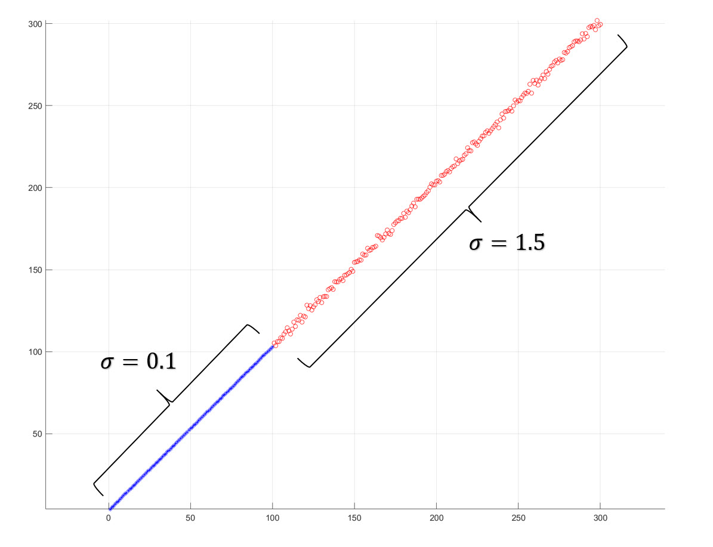
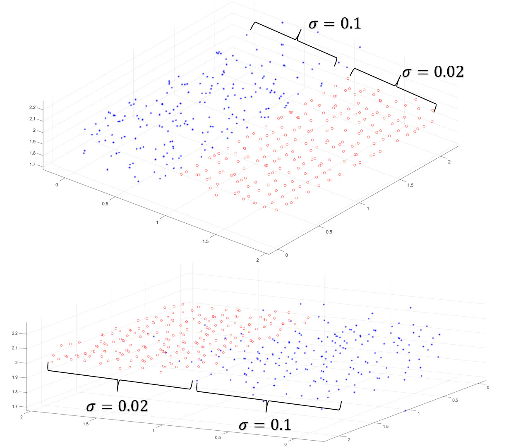
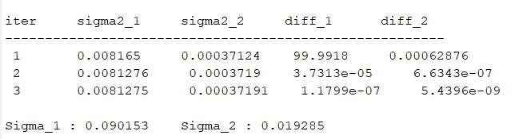

# LSVCE stimulation 

This matlab implementation of least-squares variance component estimation (LSVCE) based on A.R. Amiri Simkooei method. LSVCE be formulated as follows (taken from https://link.springer.com/article/10.1007/s00190-007-0157-x):

The weight matrix is always a constant and known value in solving the weighted least squares problem. To solve the least squares problem using the Best linear unbiased estimation (BLUE) method, the value of the weight matrix is considered equal to the covariance matrix 𝑄𝑦 of the observations.

The elements of the 𝑄𝑦 matrix include the variance of observations and the covariance between observations. And its value is always unknown because we do not know the real noise value of the sensor that collected the data.

The variance of the observations as a known parameter is included in the least squares regression. In this repository, we implement the method of least-squares variance component estimation (LSVCE). with this simple simulation, We show that LS-VCE is a simple, flexible, and attractive VCE method. 

The LS-VCE method is simple because it is based on the well-known least-squares principle. With this method, the estimation of the (co)variance components is based on a linear model of observation equations.

The simulation data was done for line and plane fitig. The data of each simulation was divided into two groups with different noises (variance). The results showed that we could estimate the standard deviation of these two groups with the help of LSVCE, assuming we don't know about the noise of these two groups of data.

## Files
- Line_fitting.m : line fitting simulation agmented by LSVCE.
- Plane_fitting.m : Plane fitting simulation agmented by LSVCE.

## Results
- Iteration of Algorithm (Up), Iteration of image and object coordinate residuals and the posteriori sigma zero (Phi) (down)  

- Show Rsiduals of first iteration (Up), Normal and t-student distribution on histogram of all residuals (down)

